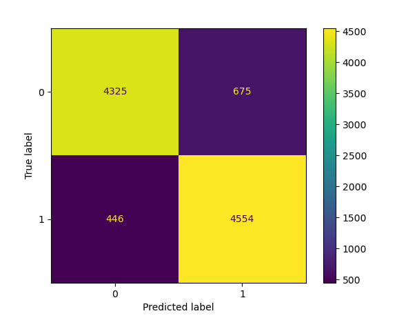

# nsfw-furry-detector

Determines if furry art is NSFW or not using a neural network.

Using the [ResNet-50](https://arxiv.org/abs/1512.03385) CNN model as the base, this model takes in a (384, 384, 3) image as the input and outputs a `0` if the image is NSFW and `1` if SFW.

## Usage:

`run_model.py` shows you how to use the `nsfw_model.tflite` file! It details a sample function for converting an image into a usable format for the model (`img_path_to_input`), a sample function for running tensorflow lite model inferences (`run_interpreter`), and an `if __name__ == '__main__'` block to show how to load the tflite model and example usage of the aforementioned functions. Be sure to check out the official [TensorFlow Lite inference guide](https://www.tensorflow.org/lite/guide/inference) for more support on how the library works.

## Accuracy

This model had an overall accuracy of ~88% when categorizing a random sample of 10k images from e621 (50/50 split of sfw & nsfw). Below is a confusion matrix detailing the results:

## FUTURE PLANS

I currently hate how this is essentially a "yes or no" model and am kicking previous me for making it that way. I would like to make a V2 version that is probabilistic and also accounts for questionable material in the probabilities (also flipping around 0/1 for sfw/nsfw because that was another dumb decision). It would end up being something similar to [0.0, 0.33) for SFW, [0.33, 0.67) for QSFW, and [0.67, 1.0] for NSFW. Because of this 

The approximate timeline is to have this version done by mid Summer, so if you are invested in this, please keep up to date with me! I will give progress updates on my Twitter, [@zenithO_o](https://twitter.com/zenithO_o), and maybe a project video on my YouTube, [@ZenithCoding](https://www.youtube.com/@ZenithCoding). :3